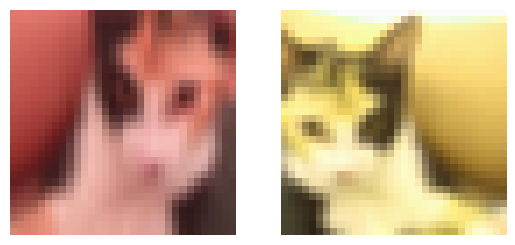

# Learning images representations with self-supervised learning

The repository contains the implementation of three loss functions allowing to learn semantically meaningful representations of images with a self-supervised approach, as well as a simple implementation of Residual Neural Network that does the encoding.

## What is self-supervised learning? 

It is a paradigm that allows to leverage vast amount of un-labeled data. Contrary to supervised learning, self-supervised learning does not need noiseless, clean labels attached to each sample to learn useful representations of the data.

It emerged as a successful family of methods behind the great progress of modern natural language processing models such as BERT or the more recent large languages models that trains on billions of tokens gathered from various sources. This paradigm have been adapted to other data modalities such as images and more recently have been demonstrating state-of-the art performances on various downstream prediction tasks such as classification, object detection, etc.

Being task agnostic, self-supervised methods are a way of learning generic representations that can be then used in various downstream tasks. They can also be more robust against noisy or corrupted inputs but are also longer and harder to train properly and require large amounts of data.

## What is implemented here? 

While it appears to exist a whole zoo of methods for various data modalities, this repository contains three slightly methods adapted for image representation learning. In particular, all three methods operate in a very similar way:

1. For every image in the training dataset, a slightly transformed version of it is generated.
2. A backbone encoder - ResNet architecture here - projects both views of the same image into the same latent vector space. Both views are represented with two different vectors in the same space and that are those representations that are used in downstream tasks.
3. The two representations are projected into another latent space, so called the "projector" space in the literature.
4. A loss function applied on those two representation is minimized with gradient descent and both the backbone encoder's and the projector's weights are optimized with back-propagation.

### Transformations

Following VICREg paper and for simplicity sake, the transformations applied to generate the two views of the same image are:

1. Random cropping sampling a patch of the original image
2. Random horizontal flip
3. Random chance of changing the brightness, hue and contrast of the image
4. Random chance of turning the image to monochrome

### Loss functions

While steps 1-3 are the same, the loss functions are different:

- **Normalized Temperature-scaled Cross Entropy (NT-Xent)** - Intuitively, it makes representations of two views of the same sample closer in the embedding space by minimizing the cosine similarity between them, while making representations of views of different samples farther.

- **Decoupled Contrastive loss (DCL)** is similar to NT-Xent with the difference that the positive pair is discarded in the denominator.

- **Variance-Invariance-Covariance Regularization (VICReg)** - Linearly combines three terms so to get interesting properties:
  - a representation loss making representations of two views of the same sample closer in the embedding space (using MSE on embedding vectors),
  - a term making the variance of each dimension of embedding vectors within a batch converge towards a gamma constant in order to avoid dimensional collapse where all samples are represented by the same vector.
  - a term making the covariance of embedding vectors within a batch converge towards a diagonal matrix in order to make each dimension as independent as possible so that dimensions encode different information.

## Getting Started 

Clone the repository:

`git clone https://github.com/clabrugere/ssl-images.git`

### Dependencies

- python 3.11
- pytorch 2.1.0
- torchvision 0.16.0

### Usage

See the notebook in `example/example.ipynb`

## References 

- [A Cookbook of Self-Supervised Learning](https://arxiv.org/abs/2304.12210)
- [A Simple Framework for Contrastive Learning of Visual Representations](https://arxiv.org/abs/2002.05709)
- [The NT-Xent loss upper bound](https://arxiv.org/abs/2205.03169v1)
- [Decoupled Contrastive Learning](https://arxiv.org/abs/2110.06848)
- [VICReg: Variance-Invariance-Covariance Regularization for Self-Supervised Learning](https://arxiv.org/abs/2105.04906)
